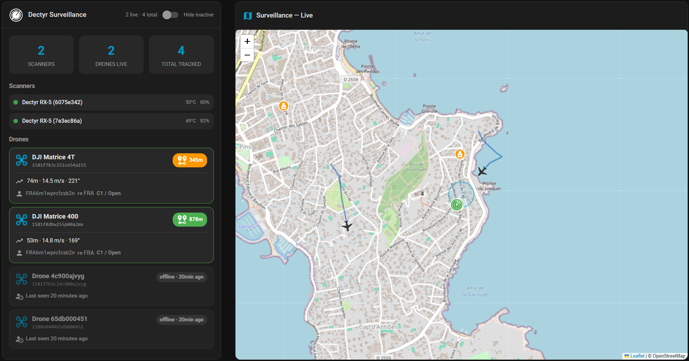

# Dectyr RX-5 for Home Assistant — passive UAV Remote ID detection

[](https://github.com/hacs/integration)
[](https://github.com/DECTYR/ha-integration/releases)
[](LICENSE)
[](https://github.com/DECTYR/ha-integration/actions/workflows/validate.yml)
[](https://github.com/DECTYR/ha-integration/actions/workflows/test.yml)

The **[DECTYR RX-5](https://dectyr.com/en/products/rx-5)** is a **passive RF**
field scanner for **UAV detection**, **UAS Remote ID**, and **broadcast drone
telemetry**—it listens for **Wi‑Fi Beacon / NaN** and **Bluetooth** (legacy and
long range) without transmitting on those bands. It suits **airspace awareness**,
site security, and **Remote ID** compliance in **France**, the **EU**, the
**USA**, **Japan**, and **Singapore**. **Manufacturer specifications** include **up to
~5 km** line‑of‑sight range, **IP67** ingress protection, **4G and Ethernet**
backhaul, and about **5 hours** of onboard **UPS** for resilient outdoor
installs.

This repository is the **Home Assistant** custom integration for the RX‑5: your
MQTT broker feeds native **devices** and **sensors** for each scanner and
**unmanned aerial vehicle** tracking, with **live maps**, **multi‑scanner** fusion,
**operator** metadata when broadcast, **geofencing** via Home Assistant **zones**,
and automations for **UAV** incursions on your own stack.



## Features

- MQTT auto-discovery for all your Dectyr detectors
- Each detected drone is created automatically as a Home Assistant **device**
- Native **map** card with scanners and drones in real time
- Full telemetry: position, altitude, speed, heading, RSSI, operator
- Scanner health: temperatures, UPS battery, GNSS, LTE, MQTT
- Remote scanner control from the UI: reboot, firmware updates, log retrieval
- Native geofencing: use Home Assistant **zones** to drive automations
- Multi-scanner: automatic merge when several detectors see the same drone
- Three ready-to-import **automation blueprints** (zone entry, critical alert,
  signal loss)

## Requirements

### Home Assistant

- **2024.1** or newer (Core + Supervisor or Container; any supported install type).

### MQTT broker

The integration is **MQTT-only**. You need a working **MQTT broker** that both
Home Assistant and every **DECTYR RX-5** scanner can reach (same logical broker,
not necessarily the same LAN).

Typical setups:

| Item | What to decide |
| --- | --- |
| **Software** | [Eclipse Mosquitto](https://mosquitto.org/) (add-on on Home Assistant OS, Docker, or package on a NAS/VM), **EMQX**, **HiveMQ**, a **managed cloud** broker, etc. |
| **Host & port** | e.g. `mqtt.home.local` and **1883** (plain) or **8883** (**TLS**). |
| **Authentication** | Create a **username/password** for clients; avoid anonymous access on exposed brokers. |
| **Access control** | Allow the RX-5 and Home Assistant to **connect**, **subscribe**, and **publish** on the topic tree you use (see prefix below). |
| **TLS / certificates** | If you use TLS, install the **same CA** (or public chain) on the scanner and ensure HA’s MQTT integration uses **TLS** with matching **verify** options. |

The RX-5 must be configured in its own UI or documentation to use **this broker**
(host, port, TLS, credentials). Home Assistant must use the **same broker** via
its MQTT integration—otherwise it will never see scanner or drone messages.

The **Dectyr RX-5** integration has **no MQTT username, password, or TLS fields
of its own**. It reuses the connection from Home Assistant’s **MQTT**
integration. Configure credentials and encryption there first.

### Eclipse Mosquitto: users, passwords, and TLS

Use **two logins** when you can: one for Home Assistant, one for the RX-5.
Do not enable anonymous access on a broker reachable from the internet.

#### 1. Create users on Mosquitto

**Home Assistant OS — official Mosquitto add-on**

1. Install **Mosquitto broker** from **Settings → Add-ons**.
2. When you later add the **MQTT** integration, Home Assistant can **set up
   Mosquitto automatically**. It then generates a **secret username/password
   for Home Assistant only**. You cannot (and should not) copy that account
   onto the RX-5.
3. Add a **separate login** for scanners in the add-on **Configuration**:

```yaml
logins:
  - username: rx5
    password: "choose-a-strong-password"
```

Save, then **restart the Mosquitto add-on**. Put that `rx5` user on each
scanner. Leave Home Assistant on the auto-generated account.

**Standalone or Docker Mosquitto** (not the add-on)

Create a password file and disable anonymous access:

```bash
mosquitto_passwd -c /mosquitto/config/passwd homeassistant
mosquitto_passwd    /mosquitto/config/passwd rx5
```

In `mosquitto.conf`:

```conf
listener 1883
allow_anonymous false
password_file /mosquitto/config/passwd
```

Restart Mosquitto. Use `homeassistant` in Home Assistant and `rx5` on the
scanners (or the same user on both if you prefer a simpler lab setup).

#### 2. Connect Home Assistant (username and password)

1. **Settings → Devices & services → + Add integration → MQTT**.
2. If you use the official Mosquitto add-on, accept **automatic
   configuration** when offered. Home Assistant fills in broker, port, user,
   and password; you are done for the HA client.
3. Otherwise enter:
   - **Broker**: hostname or IP of Mosquitto (e.g. `192.168.1.10` or
     `mqtt.example.com`). From Home Assistant Container, `localhost` is the
     **container**, not the Pi — use the host IP or the Docker service name.
   - **Port**: `1883` without TLS, `8883` with TLS (see below).
   - **Username** / **Password**: the Mosquitto user for Home Assistant.
4. Submit. The MQTT integration card should show **Connected**.

To change credentials later: **Settings → Devices & services → MQTT →
Configure → Reconfigure**.

Confirm with a subscribe (add `-u` / `-P` if anonymous access is off):

```bash
mosquitto_sub -h <broker> -p 1883 -u homeassistant -P '<password>' \
  -t 'dronedetector/#' -v
```

#### 3. TLS (MQTT over TLS, typically port 8883)

Enable TLS on Mosquitto **and** in Home Assistant. The RX-5 must use the
**same host, port, and CA**. Home Assistant requires MQTT **protocol version
5** (Mosquitto 2.x does).

Example Mosquitto TLS listener (adjust paths):

```conf
listener 8883
allow_anonymous false
password_file /mosquitto/config/passwd
cafile /mosquitto/config/ca.crt
certfile /mosquitto/config/server.crt
keyfile /mosquitto/config/server.key
# require_certificate false   # set true only if you use client certificates (mTLS)
```

The certificate **CN / SAN must match** the hostname (or IP) you type in
Home Assistant. A cert for `mqtt.example.com` will fail if HA connects to
`192.168.1.10`.

In the MQTT integration (add or **Reconfigure**), set **Port** to `8883`,
then open **Other settings**:

| Home Assistant control | When to use |
| --- | --- |
| **Broker certificate validation → Auto** | Broker cert is from a public CA (e.g. Let’s Encrypt). HA uses its bundled CAs. |
| **Broker certificate validation → Custom** | Self-signed or private CA. Choose **Next** and upload the **CA** file (PEM or DER), not the server cert. |
| **Ignore broker certificate validation** | Only if the name in the cert does not match the broker host. Prefer fixing the cert/SAN instead. |
| **Use a client certificate** | Only if Mosquitto has `require_certificate true` (mTLS). Upload **client cert + private key** together (PEM or DER). If the key is encrypted, enter its password when uploading. |

Client certificates are applied only when broker certificate validation is
enabled.

If you see `SSL: CERTIFICATE_VERIFY_FAILED`, try **Broker certificate
validation → Auto** for a public CA, or **Custom** with your Mosquitto CA
for a private PKI. Wrong file (server cert instead of CA) or hostname
mismatch are the usual causes.

Plain MQTT (port **1883**, no TLS) is acceptable on a trusted LAN. Use TLS
whenever the broker is reachable off-LAN (4G scanners, VPN, internet).

#### 4. Point the RX-5 at the same broker

On the scanner, set the **same** broker host, port (`1883` or `8883`),
username/password (the `rx5` login), and TLS/CA as Mosquitto. A mismatch
here looks like “MQTT works in HA but no Dectyr devices”.

### Home Assistant MQTT integration (mandatory)

The **Dectyr RX-5** integration **refuses to start** until at least one MQTT
config entry is **loaded** (you would see an abort reason such as **MQTT
required** if you skip this step). After MQTT shows **Connected**, add
**Dectyr RX-5** under **Settings → Devices & services**.

### MQTT topic prefix (must match the scanners)

When you add the Dectyr integration you enter the **MQTT prefix** (factory-style
default **`dronedetector`**). It must **exactly** match the root prefix configured
on each RX-5 so that topics line up, for example:

- `{prefix}/{scanner_id}/status` — scanner online / health
- `{prefix}/{scanner_id}/drones/{drone_id}/data` — drone telemetry
- `{prefix}/{scanner_id}/errors` — scanner errors
- `{prefix}/{scanner_id}/commands` (+ `…/response`) — remote commands

Allowed characters in the prefix: letters, digits, **`_`**, **`/`**, and **`-`**
(no spaces). Multi-segment prefixes such as `org/site1` are supported.

If the prefix is wrong, Home Assistant will stay **empty of Dectyr devices**
even though MQTT works for other clients.

### Optional: integration options (after setup)

Under **Settings → Devices & services → Dectyr RX-5 → Configure**, you can tune
(all values are seconds unless noted):

| Option | Default (seconds) | Role |
| --- | ---: | --- |
| **Drone inactivity timeout** | `300` | How long without drone telemetry before a drone is marked unavailable. |
| **Drone purge after** | `86400` | How long before a stale drone is removed from the registry. |
| **Scanner offline timeout** | `60` | How long without scanner status before treating the scanner as offline. |
| **Command timeout** | `30` | Max wait for MQTT command responses (reboot, logs, etc.). |
| **Unknown scanner warning** | on | Issue registry warning if a scanner publishes before you have a retained **status** for it. |

### What you still configure on the hardware

RX-5 **Wi‑Fi / 4G / Ethernet**, **MQTT broker URL**, **TLS**, **credentials**, and
the **same topic prefix** as in Home Assistant are all set on the device (or via
vendor tooling)—see **Dectyr** product documentation for the exact menus.

## Installation

### Via HACS (recommended)

This integration is in the **HACS default store**. Search for **Dectyr RX-5**, download it, then restart Home Assistant.

[](https://my.home-assistant.io/redirect/hacs_repository/?owner=DECTYR&repository=ha-integration&category=integration)

1. Open HACS → search **Dectyr RX-5** (or use the badge above)
2. **Download**
3. Restart Home Assistant
4. Settings → Devices & services → **Add integration** → **Dectyr RX-5**

If it does not appear in search yet, add it once as a custom repository:
`https://github.com/DECTYR/ha-integration` (category **Integration**).

### Manual installation

Copy `custom_components/dectyr_rx5/` to your `config/custom_components/` folder and restart Home Assistant.

## Scanner configuration

On each RX-5, point **MQTT** to the **same broker** as Home Assistant and use the
**same prefix** as in **Requirements** above. For field menus, certificates, and
cellular backhaul, follow **Dectyr** device documentation or vendor support.

## Lovelace cards

The integration ships with two custom Lovelace cards that work
together to build a complete drone surveillance dashboard:

- **`dectyr-surveillance-card`** — drone list with rich telemetry
  cards, stats tiles, scanner status, and a "Hide inactive" toggle.
- **`dectyr-map-card`** — live Leaflet map with drone markers
  oriented by heading, scanner radar icons, operator silhouettes,
  home zone circle, and 30-minute trail polylines.

Both cards auto-discover all DECTYR entities via the integration
platform — no card configuration is needed. They register
automatically when the integration starts; no extra Lovelace
resource line is needed.

### Recommended dashboard

A 1/3 list + 2/3 map layout works well on desktop. Add a new view
of type **Sections** with `max_columns: 12`, then drop both cards
side by side:

```yaml
type: sections
max_columns: 12
sections:
  - type: grid
    cards:
      - type: custom:dectyr-surveillance-card
        grid_options:
          columns: 4
          rows: 8
      - type: custom:dectyr-map-card
        title: Surveillance — Live
        aspect_ratio: '1:1'
        grid_options:
          columns: 8
          rows: 8
```

The map card supports `aspect_ratio` (e.g. `'16:9'`, `'1:1'`,
`'3:1'`) and `height` (in pixels) properties for fine-grained
sizing on top of `grid_options`.

For full configuration options, see [docs/cards.md](docs/cards.md).

### Alternative: native Home Assistant map

If you prefer the built-in Home Assistant map (no JavaScript
custom cards), it can also display Dectyr drones and scanners
through the `device_tracker.*_position_du_drone` and
`device_tracker.*_position_du_scanner` entities exposed by this
integration:

```yaml
type: map
title: Drone tracking
entities:
  - device_tracker.matrice_4t_position_du_drone
  - device_tracker.dectyr_rx_5_6075e342_position_du_scanner
hours_to_show: 1
auto_fit: true
```

Tip: combine with the [auto-entities](https://github.com/thomasloven/lovelace-auto-entities)
HACS card to dynamically include all detected drones without
listing each entity manually.

## Services

### `dectyr_rx5.send_command`

Publishes an MQTT command to the scanner and waits for the response.

```yaml
service: dectyr_rx5.send_command
data:
  device_id: abc123def4567890abcdef4567890ab
  action: reboot
  params: {}
response_variable: cmd_result
```

### `dectyr_rx5.clear_drone`

Removes a drone from the integration registry and the device registry.

```yaml
service: dectyr_rx5.clear_drone
data:
  device_id: drone_device_id_here
```

### `dectyr_rx5.export_drones`

Returns the list of known drones (**service response**).

```yaml
service: dectyr_rx5.export_drones
data:
  include_inactive: false
response_variable: drones_export
```

## Events

| Event | Short description |
| --- | --- |
| `dectyr_rx5_drone_detected` | New drone (includes `latitude`, `longitude`, `manufacturer`, `model`, `payload`) |
| `dectyr_rx5_drone_lost` | Drone inactive (telemetry timeout) |
| `dectyr_rx5_drone_purged` | Drone removed after extended inactivity |
| `dectyr_rx5_scanner_alert` | Scanner critical alert |
| `dectyr_rx5_scanner_error` | Error payload on the errors topic |
| `dectyr_rx5_logs_received` | Logs returned by `get_logs` |

Example **trigger**:

```yaml
trigger:
  - platform: event
    event_type: dectyr_rx5_drone_detected
```

## Blueprints

Files live under `custom_components/dectyr_rx5/blueprints/automation/dectyr_rx5/`:

- [`notify_drone_in_zone.yaml`](https://github.com/dectyr/ha-integration/blob/main/custom_components/dectyr_rx5/blueprints/automation/dectyr_rx5/notify_drone_in_zone.yaml) &mdash; notify when a drone enters a zone
- [`notify_scanner_critical_alert.yaml`](https://github.com/dectyr/ha-integration/blob/main/custom_components/dectyr_rx5/blueprints/automation/dectyr_rx5/notify_scanner_critical_alert.yaml) &mdash; scanner critical alert
- [`notify_drone_lost.yaml`](https://github.com/dectyr/ha-integration/blob/main/custom_components/dectyr_rx5/blueprints/automation/dectyr_rx5/notify_drone_lost.yaml) &mdash; drone signal loss

In Home Assistant: **Settings &rarr; Automations & scenes &rarr; Blueprints &rarr;
Import blueprint**, then paste the raw GitHub URL of the YAML you want.

## Troubleshooting

- No drones appear &rarr; verify MQTT (**Settings &rarr; Devices & services &rarr;
  MQTT &rarr; Configure**), then listen on `dronedetector/#` or your custom prefix.
- A drone disappears too quickly &rarr; increase `drone_inactivity_timeout` in the
  integration **options**.
- Verbose logging in `configuration.yaml`:

```yaml
logger:
  logs:
    custom_components.dectyr_rx5: debug
```

## Contributing

See [CONTRIBUTING.md](CONTRIBUTING.md).

## License

MIT &mdash; see [LICENSE](LICENSE).
